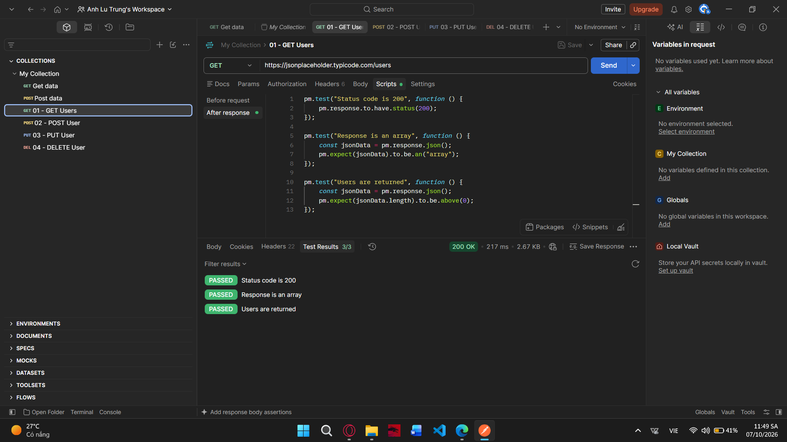
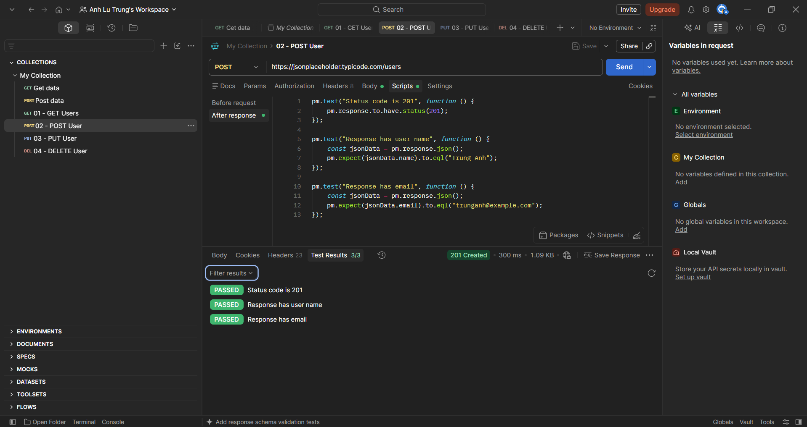
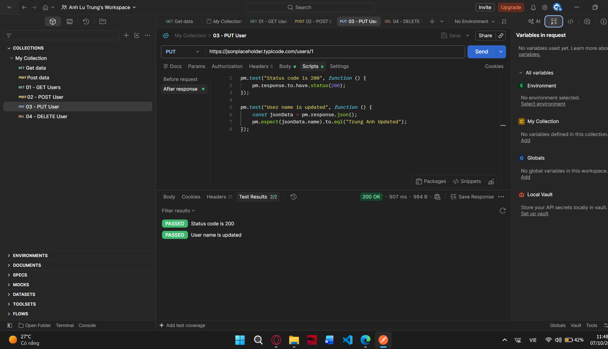
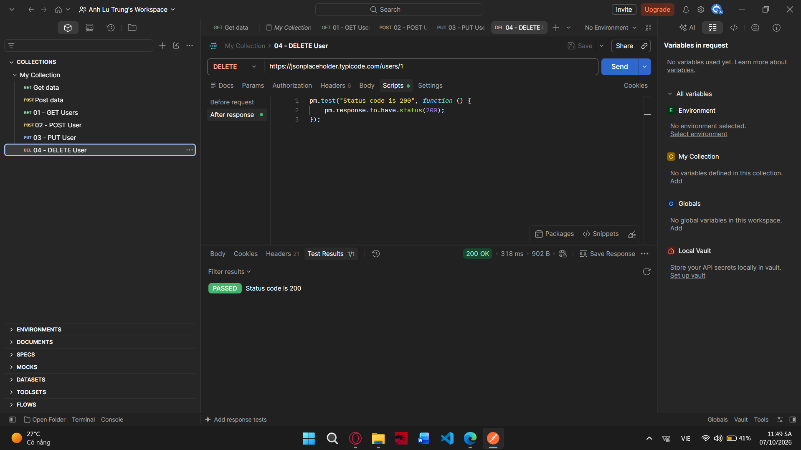

# Postman API Testing

## 1. Introduction

This project is a practice project for learning API testing with Postman.

## 2. Tools

- Postman
- GitHub
- JSONPlaceholder API

## 3. API Testing

### 3.1 GET Users

**Method:** GET

**Endpoint:**

https://jsonplaceholder.typicode.com/users

**Purpose:** Get a list of users.

---

### 3.2 POST User

**Method:** POST

**Endpoint:**

https://jsonplaceholder.typicode.com/users

**Purpose:** Create a new user.

---

### 3.3 PUT User

**Method:** PUT

**Endpoint:**

https://jsonplaceholder.typicode.com/users/1

**Purpose:** Update user information.

---

### 3.4 DELETE User

**Method:** DELETE

**Endpoint:**

https://jsonplaceholder.typicode.com/users/1

**Purpose:** Delete a user.

---

## 4. Test Results

The APIs were tested successfully using Postman.

The tests include:

- Status code validation
- Response data validation
- User name validation
- Email validation

## 5. Conclusion

Through this practice, I learned how to use Postman to send API requests and verify API responses.
